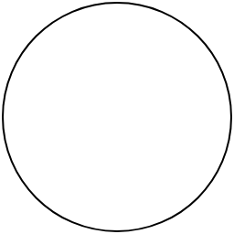
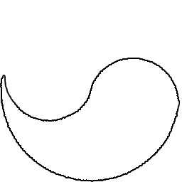

# potatowzrd.github.io

<button type="button" onclick="clicked()">Click the button, join!</button>

<button type="button" onclick="clicked2()">Click the button, 2!</button>

<h1>Marble Name Generator</h1>

<button type="button" onclick="nameGen()">Name!</button>

    
    

